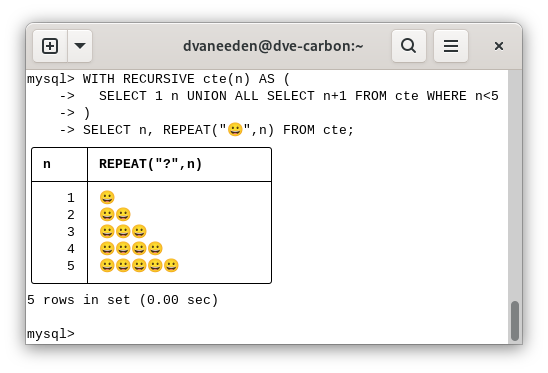
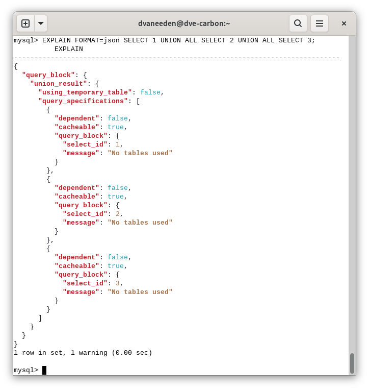
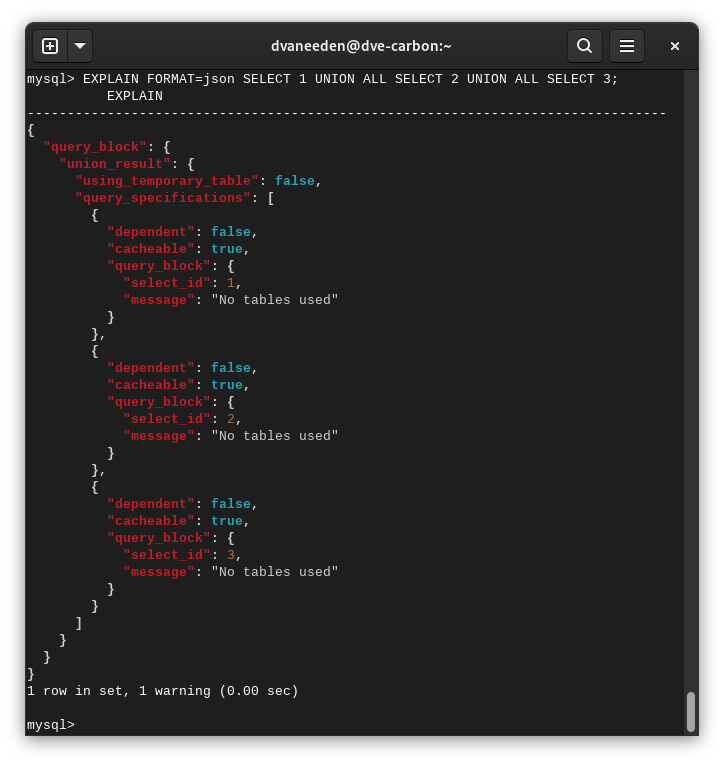

# Explainify

Explainify is a pager program for the [MySQL Client](https://dev.mysql.com/doc/en/mysql.html) that attempts to make `EXPLAIN` and other output to look nicer.

## Features

### Unicode tables

```
mysql> WITH RECURSIVE cte(n) AS (SELECT 1 n UNION ALL SELECT n+1 FROM cte WHERE n<5) SELECT n, REPEAT("abc",n) FROM cte;
+------+-----------------+
| n    | REPEAT("abc",n) |
+------+-----------------+
|    1 | abc             |
|    2 | abcabc          |
|    3 | abcabcabc       |
|    4 | abcabcabcabc    |
|    5 | abcabcabcabcabc |
+------+-----------------+
5 rows in set (0.00 sec)
```

becomes

```
mysql> WITH RECURSIVE cte(n) AS (SELECT 1 n UNION ALL SELECT n+1 FROM cte WHERE n<5) SELECT n, REPEAT("abc",n) FROM cte;
╭──────┬─────────────────╮
│ n    │ REPEAT("abc",n) │
├──────┼─────────────────┤
│    1 │ abc             │
│    2 │ abcabc          │
│    3 │ abcabcabc       │
│    4 │ abcabcabcabc    │
│    5 │ abcabcabcabcabc │
╰──────┴─────────────────╯
5 rows in set (0.00 sec)
```

This also attempts to fix the issue that wide characters like emojis mess up the layout:

```
mysql> WITH RECURSIVE cte(n) AS (SELECT 1 n UNION ALL SELECT n+1 FROM cte WHERE n<5) SELECT n, REPEAT("😀",n) FROM cte;
+------+----------------------+
| n    | REPEAT("?",n)        |
+------+----------------------+
|    1 | 😀                     |
|    2 | 😀😀                     |
|    3 | 😀😀😀                     |
|    4 | 😀😀😀😀                     |
|    5 | 😀😀😀😀😀                     |
+------+----------------------+
5 rows in set (0.00 sec)
```

```
mysql> WITH RECURSIVE cte(n) AS (SELECT 1 n UNION ALL SELECT n+1 FROM cte WHERE n<5) SELECT n, REPEAT("😀",n) FROM cte;
╭──────┬──────────────────────╮
│ n    │ REPEAT("?",n)        │
├──────┼──────────────────────┤
│    1 │ 😀                   │
│    2 │ 😀😀                 │
│    3 │ 😀😀😀               │
│    4 │ 😀😀😀😀             │
│    5 │ 😀😀😀😀😀           │
╰──────┴──────────────────────╯
5 rows in set (0.00 sec)
```

Note that I tested this with `gnome-terminal` and there it looks better than how GitHub renders Markdown.



### Markdown tables

This makes it easy to copy-paste tables into markdown documentation.

```
mysql> WITH RECURSIVE cte(n) AS (SELECT 1 n UNION ALL SELECT n+1 FROM cte WHERE n<5) SELECT n, REPEAT("abc",n) FROM cte;
+------+-----------------+
| n    | REPEAT("abc",n) |
+------+-----------------+
|    1 | abc             |
|    2 | abcabc          |
|    3 | abcabcabc       |
|    4 | abcabcabcabc    |
|    5 | abcabcabcabcabc |
+------+-----------------+
5 rows in set (0.00 sec)
```

becomes

```
mysql> WITH RECURSIVE cte(n) AS (SELECT 1 n UNION ALL SELECT n+1 FROM cte WHERE n<5) SELECT n, REPEAT("abc",n) FROM cte;
| n    | REPEAT("abc",n) |
|------|-----------------|
|    1 | abc             |
|    2 | abcabc          |
|    3 | abcabcabc       |
|    4 | abcabcabcabc    |
|    5 | abcabcabcabcabc |
5 rows in set (0.00 sec)
```

And rendered this looks like:

| n    | REPEAT("abc",n) |
|------|-----------------|
|    1 | abc             |
|    2 | abcabc          |
|    3 | abcabcabc       |
|    4 | abcabcabcabc    |
|    5 | abcabcabcabcabc |

### Improved explain output for JSON and TREE

```
mysql> EXPLAIN FORMAT=json SELECT 1 UNION ALL SELECT 2 UNION ALL SELECT 3\G
*************************** 1. row ***************************
EXPLAIN: {
  "query_block": {
    "union_result": {
      "using_temporary_table": false,
      "query_specifications": [
        {
          "dependent": false,
          "cacheable": true,
          "query_block": {
            "select_id": 1,
            "message": "No tables used"
          }
        },
        {
          "dependent": false,
          "cacheable": true,
          "query_block": {
            "select_id": 2,
            "message": "No tables used"
          }
        },
        {
          "dependent": false,
          "cacheable": true,
          "query_block": {
            "select_id": 3,
            "message": "No tables used"
          }
        }
      ]
    }
  }
}
1 row in set, 1 warning (0.01 sec)
```

```
mysql> EXPLAIN FORMAT=json SELECT 1 UNION ALL SELECT 2 UNION ALL SELECT 3;
          EXPLAIN
--------------------------------------------------------------------------------
{
  "query_block": {
    "union_result": {
      "using_temporary_table": false,
      "query_specifications": [
        {
          "dependent": false,
          "cacheable": true,
          "query_block": {
            "select_id": 1,
            "message": "No tables used"
          }
        },
        {
          "dependent": false,
          "cacheable": true,
          "query_block": {
            "select_id": 2,
            "message": "No tables used"
          }
        },
        {
          "dependent": false,
          "cacheable": true,
          "query_block": {
            "select_id": 3,
            "message": "No tables used"
          }
        }
      ]
    }
  }
}
1 row in set, 1 warning (0.00 sec)
```

Note that `EXPLAIN FORMAT=JSON...` normally requires the use of `\G` or `--auto-vertical-output` as the default table based format looks even worse as it wasn't made for single row, single column, multi line output.

And it does syntax highlighting for JSON explain:



And it supports multiple themes:



And for the TREE format:

```
mysql> EXPLAIN FORMAT=tree SELECT 1 UNION ALL SELECT 2 UNION ALL SELECT 3\G
*************************** 1. row ***************************
EXPLAIN: -> Append  (cost=0..0 rows=3)
    -> Stream results  (cost=0..0 rows=1)
        -> Rows fetched before execution  (cost=0..0 rows=1)
    -> Stream results  (cost=0..0 rows=1)
        -> Rows fetched before execution  (cost=0..0 rows=1)
    -> Stream results  (cost=0..0 rows=1)
        -> Rows fetched before execution  (cost=0..0 rows=1)

1 row in set (0.00 sec)
```

```
mysql> EXPLAIN FORMAT=tree SELECT 1 UNION ALL SELECT 2 UNION ALL SELECT 3;
          EXPLAIN
--------------------------------------------------------------------------------
-> Append  (cost=0..0 rows=3)
    -> Stream results  (cost=0..0 rows=1)
        -> Rows fetched before execution  (cost=0..0 rows=1)
    -> Stream results  (cost=0..0 rows=1)
        -> Rows fetched before execution  (cost=0..0 rows=1)
    -> Stream results  (cost=0..0 rows=1)
        -> Rows fetched before execution  (cost=0..0 rows=1)

1 row in set (0.00 sec)
```

## Usage

When starting the MySQL Client:
```
mysql --pager=/path/to/explainify
```

When already in the MySQL Client:
```
pager /path/to/explainify
```

To disable:
```
nopager
```

Options:
```
Usage of explainify:
  -format string
    	output format: plain, markdown or unicode (default "unicode")
  -theme string
    	chroma syntax highlighting theme (default "monokailight")
```

## Building

The `explainify` binary can be build by checking out this repository and running `go build`.

```
% git clone https://github.com/dveeden/explainify.git
Cloning into 'explainify'...
remote: Enumerating objects: 17, done.
remote: Counting objects: 100% (17/17), done.
remote: Compressing objects: 100% (13/13), done.
remote: Total 17 (delta 4), reused 16 (delta 3), pack-reused 0 (from 0)
Receiving objects: 100% (17/17), 142.67 KiB | 2.80 MiB/s, done.
Resolving deltas: 100% (4/4), done.
% cd explainify
% go build
go: downloading github.com/alecthomas/chroma/v2 v2.15.0
go: downloading golang.org/x/text v0.22.0
go: downloading github.com/dlclark/regexp2 v1.11.5
dveeden@nas2:~/explainify % ./explainify -h
Usage of ./explainify:
  -format string
    	output format: plain, markdown or unicode (default "unicode")
  -theme string
    	chroma syntax highlighting theme (default "monokailight")
```

## Related

- [Bug #77279: Use unicode to draw borders (contribution)](https://bugs.mysql.com/bug.php?id=77279)
- [Bug #116573: Allow plugins to do formatting of output in MySQL Shell](https://bugs.mysql.com/bug.php?id=116573)